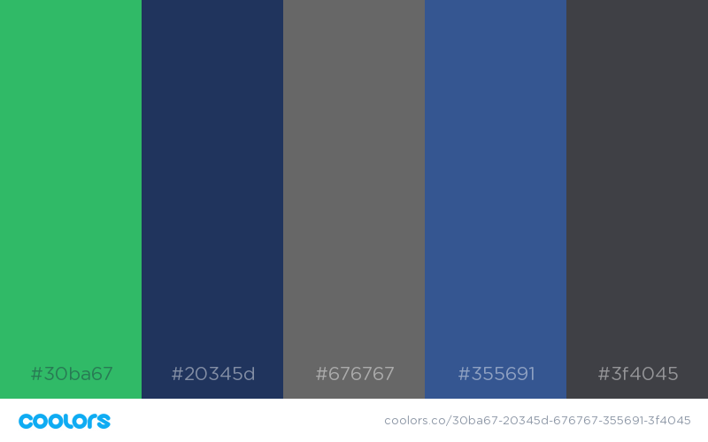

# AltUpdates

AltUpdates is a student progress management system that helps AltCampus to track their student's progress on the basis of their daily updates. On this projects we just provide them a structured way where they can manage their daily information and helps them to analyze their performance.

## Project Wireframe

## Getting Started
For getting started follow the given steps:- 
1 - First clone the repo using `git clone https://github.com/AltCampus/altUpdates.git`. 
2 - Then go the project directory using `cd altUpdates`.

3 - The go to development branch `git checkout development`.

For this project we just divided this into two main parts:-
* **Front-End Part** - React, Redux and CSS3
  
  #### How to start Front End
  To get started with front-end follow the following steps :-  
  1 - Go the front-end folder by `cd front-end`. 
  2 - Then start the development server using `npm start`. 

* **Back-End Part** - Node.js with Express and Mongodb 
  #### How to start Back End
  To get started with front-end follow the following steps :-  
  1 - Go the front-end folder by `cd back-end`. 
  2 - Then start the development server using `npm start`.

## Color Pallet

## Class Convention
For this project we just follow the BEM class convention. To read more about it go to this [link](https://css-tricks.com/bem-101/).

